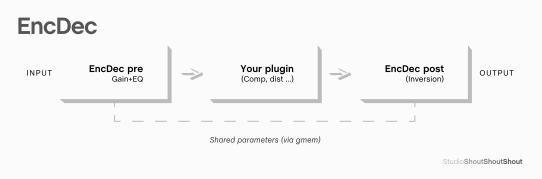

# EncDec 
 ## Pre/Post EQ and Gain Utility (StudioShoutShoutShout, JSFX)

A utility JSFX pair that alter the input signal to your preferred plugins and restores it on the way out. Designed for encode/decode-style processing chains, suited for creative compression, transient shaping, and frequency-specific control. Using transparent pre/post EQ and gain trimming with shared `gmem` synchronization. No rocket science, just a bit more convenience. 

## Features

- Global gain trim with automatic compensation.
- Single-band parametric EQ: Gain, Frequency, Q.
- Parameter synchronisation between pre and post instances (via `gmem`).
- Ideal for use with compressors, distortion, saturation, or other processors.

## Usage

1. Insert **EncDec pre** `shoutshoutshout__enc_dec_pre.jsfx` before your plugin (e.g. compressor).
2. Insert **EncDec post** `shoutshoutshout__enc_dec_post.jsfx` after the same plugin.
3. Adjust gain and EQ in the **Pre** instance — the **Post** instance automatically mirrors the settings (inverted where relevant).

## Parameters

| Control        | Function                         |
|----------------|----------------------------------|
| Global Gain    | Adjusts pre-input level          |
| EQ Frequency   | 50 Hz – 5 kHz                    |
| EQ Q           | 0.1 – 10 (narrow to wide)        |
| EQ Cut/Boost   | ±30 dB cut/boost                 |
| Bypass         | Bypass both instances            |

## Use cases

- **Reviving a dull snare**  
  A lifeless snare drum can gain energy and presence through frequency-targeted distortion. Insert the **Pre** and **Post** instances of this plugin around a distortion plugin. Use a generous EQ boost with a medium Q in the upper midrange (e.g. 2–5 kHz) to focus the distortion. Works great in parallel with the clean signal.

- **Controlling a kick in stereo drum bus**  
  When the kick drum feels too dominant or flappy or whatever, insert your favourite compressor between the **Pre** and **Post** instances. Use the Pre-EQ to boost a low frequency (e.g. 50–80 Hz) that aligns with the kick's fundamental. This causes the compressor to respond more aggressively to kick hits — tightening the low end without EQing the final output.
  
- **Adds threshold with auto(ish) gain**  
 When a compressor lacks control over the threshold this can be used as a rudimentary control. Without affecting the output signal in a way that a simple trim plugin would. Or if the compressor lacks the headroom of your preferred gain staging.
 
 - **De-esser**  
  Could probably be used as a (probably at most interesting) de-esser. In case your favourite compressor lacks a sidechain. 
 


## Installation

Place the `.jsfx` files in your JSFX effects folder according to your OS. Then restart Reaper.

### Possible locations

```
macOS: /Library/Application Support/REAPER/Effects/ (or might be in your user library)
Windows: C:\Users\YourName\AppData\Roaming\REAPER\Effects\
```

## License

MIT

Learn more about JSFX: https://www.reaper.fm/sdk/js/js.php
